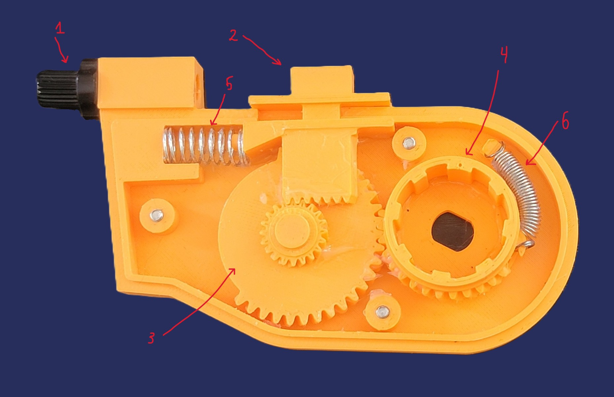
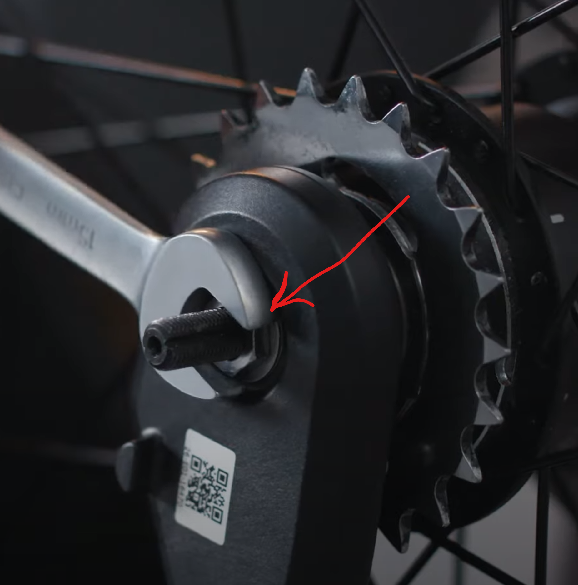

Vanmoof S3 BUTIM Shifter!
--------

Overview
--------

This is Vanmoof S3 E-shifter replacement aka **BUTIM Shifter**
 
I am continuously improving the mechanism.
 
Let me know if you have any question.
   

Parts you need
--------

* **3D printed parts**: Top, Bottom, Intermediate gear, Helical gear, Involute Rack(cable shifter)
   
   
  Printing settings:
   
  Material: **PLA or PETG**
   
  Infill: for Top and Bottom case **15%** or **20%**; for gears I would recommend at least **60%**;
  Involute rack **70%** and if your PLA is soft then **100%** is recommended.

  
  
* **Shimano Gear shifter** like 4 or 6 speed. Cable must travel **2.8mm** on each gear shift. Shimano 7 speed has a shorter cable travel, so it won't work.
  
  
* **M7 Brake Lever Adjuster**
  
  
* **x3 M3 heat insert nut**
* **x3 M3 screws** 20mm-25mm
* **Bike cable fixing bolt**
* **Spring** - Diameter: 9mm, Length: 3-5 cm
* **Spring** - Diameter: 4mm-6mm, Length: 2-4 cm
* **Wire Fixing Bolt**
  
  
* **Silicon grease or any other plastic compatabile grease**

Assembling
----------

 

1. **M7 Brake Lever Adjuster**
2. **Cable Shifter**
3. **Intermediate gear**
4. **Helical gear**
5. **Spring with diameter 9mm**
6. **VERY VERY OPTIONAL** **Spring with diameter 5mm**

**Instruction:**
 
Before assembling, make sure that you put enough silicone grease. It will make shifting way smoother. After assembling add more grease.
 
The helical gear has a dot that indicates the current gear. Each gear corresponds to 30 degrees of rotation, so moving from first gear to fourth gear requires a total rotation of 90 degrees. Adjust Cable shifter(Involute Rack) that way that switching from first gear to fourth gear is within the range.
Shimano Revoshift needs to be cut for proper fit and not blocking a brake leverage. I used soldering iron and just melted by creating a pocket for brake leverage and it worked well.
 
 
**DON'T TIGHT THIS ONE MUCH. JUST LIGHTLY**

   

**Enjoying this project? Buy me a coffee**
 

