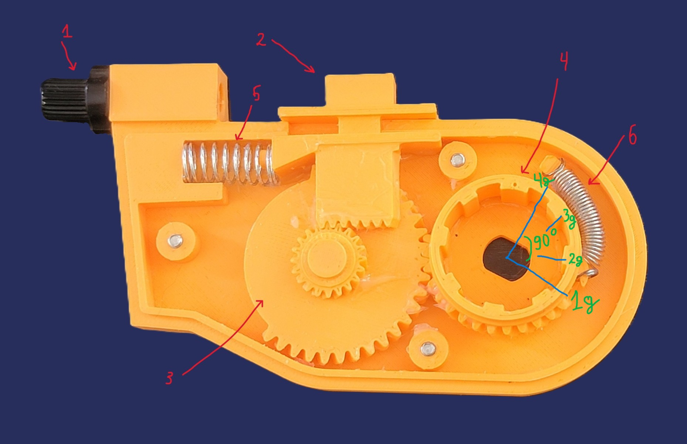

Vanmoof S3 E-shifter replacement
--------

Overview
--------

This is Vanmoof S3 E-shifter replacement.
 
I am continuously improving the mechanism as it is still under testing.
 
Let me know if you have any question.
   

Parts you need
--------

* **3D printed parts**: Top, Bottom, Intermediate gear, Helical gear, Involute Rack(cable shifter)
   
   
  Printing settings:
   
  Material: **PLA or PETG**
   
  Infill: for Top and Bottom case **15%** or **20%**; for gears I would recommend at least **60%**

  
  
* **Shimano Gear shifter** like 4 or 6 speed. Cable must travel **2.8mm** on each gear shift. Shimano 7 speed has a shorter cable travel, so it won't work.
  
  
* **M7 Brake Lever Adjuster**
  
  
* **x3 M3 heat insert nut**
* **x3 M3 screws** 20mm-25mm
* **Bike cable fixing bolt**
* **Spring** - Diameter: 9mm, Length: 3-5 cm
* **Spring** - Diameter: 4mm-6mm, Length: 2-4 cm

Assembling
----------

 
1. **M7 Brake Lever Adjuster**
2. **Cable Shifter**
3. **Intermediate gear**
4. **Helical gear**
5. **Spring with diameter 9mm**
6. **Spring with diameter 5mm**

**Instruction:**
 
Before assembling, make sure that you put enough of silicone grease. It will make shifting way smoother. After assembling add more grease.
 
The helical gear has a dot that indicates the current gear. Each gear corresponds to 30 degrees of rotation, so moving from first gear to fourth gear requires a total rotation of 90 degrees. Adjust Cable shifter(Involute Rack) that way that switching from first gear to fourth gear is within the range.

Donation
--------
If you liked this shifter and want to support the project, you could donate here:
 
Paypal: cruel.programmer@gmail.com
